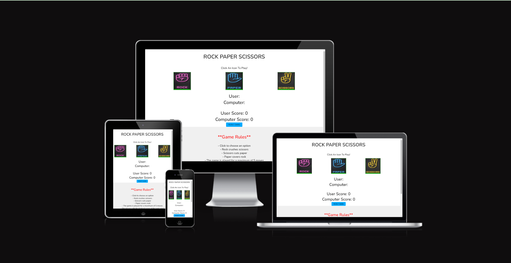
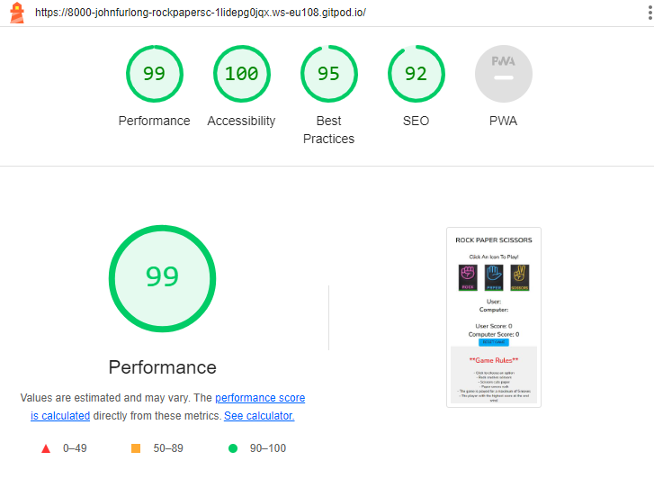

# Rock Paper Scissors

Welcome to Rock Paper Scissors, classic game of strategy and luck! Challenge your skills against the computer in this timeless game.

## Project Overview

- The Rock Paper Scissors Game is an interactive web application designed to simulate the classic hand game where players choose between rock, paper, or scissors. The game is built with HTML, CSS, and JavaScript, providing a simple yet engaging user interface for a quick and fun play against a computer opponent.

## Key Project Goals

- Educational Purpose: Serve as a learning tool for individuals new to programming and web development by demonstrating basic principles of JavaScript and interactive web design.
- User Engagement: Create an intuitive and engaging user experience that encourages repeated play and interaction.
- Responsiveness: Design the game to be fully responsive, ensuring a seamless experience across various devices and screen sizes.
- Extendibility: Structure the code in a way that allows for easy extension, such as adding new game modes or features in the future.

## Target Audience

- Beginner Web Developers: Individuals looking to understand the basics of JavaScript, HTML, and CSS through practical application.
- Casual Gamers: Users seeking a quick and entertaining break, offering an easy-to-understand game that can be played in short sessions.
- Educators: Teachers and educators who require a simple interactive tool to introduce programming concepts or logical thinking to their students.

## User Experience - UX

### User Stories

**As a Player, I want to:**

- Quickly understand the rules of the game.
- Easily navigate through the game interface.
- Have clear feedback on the outcome of each round.

**As a website visitor, I want to:**

- Immediately grasp the purpose of the website.
- Have a smooth experience while interacting with the website, regardless of the device I'm using.

## Conclusion

- The Rock Paper Scissors Game project is more than just a game; it's a gateway to learning web development and programming fundamentals. By engaging with this project, users of all ages can enjoy the timeless game of Rock Paper Scissors while gaining valuable insights into the workings of web applications. Whether you're a student, educator, or just someone looking to kill time, this game is designed with you in mind.

## Features
- **Header**
  - The header showcases the name of the game "Rock Paper Scissors".

  

  - **Game Options**
  -The game options area is where the user can make a choice with option he wants to pick: rock, paper or scissors. This is an interactive area where the user selects a button of their choice.

  

  - **Results area with reset game button**
  -The results area displays the outcome of each round of the game, including the user's and computer's choices, as well as the overall game result. Additionally, a reset game button is provided to start a new game.

     

  - **Footer area with game rules**
  -The footer area contains the game rules, providing instructions on how to play the game, including the rules for winning and resetting the game.

  

  ## Technogolgy Used

### Languages Used
- HTML
- CSS
- JavaScript  

### Programs Used
- I used Google fonts to import the fonts throughout the style.css.(https://fonts.google.com/)
- I used a Favicon generator for my icon. (https://favicon.io/favicon-generator/)
- I used Pinterest for my game options button images. (https://www.pinterest.ie/)
- I used Am I Responive for my mock up. (https://ui.dev/amiresponsive)

## Testing

- I ensured that all form fields function correctly and validate input data effectively.

- I conducted thorough testing to ensure that all pages are user-friendly and easy to navigate, with clear and legible content.

- I verified that all images load properly on each page, ensuring a seamless visual experience for users.

- I rigorously tested all buttons and links to confirm that they function as expected, allowing smooth navigation throughout the website without encountering any issues.

- I made sure that the project is responsive and looks good on standard devices. Including :
   - Ipad Air          820 x 1180
   - Ipad              768 x 1024
   - Iphone 4          320 x 480
   - Iphone 6/7/8      375 x 667
   - Iphone 12 pro     390 x 844
   - Iphone 14 pro max 430 x 932
   - Galaxy S8         360 x 740

### Validator Testing

- HTML
  - I made sure there were no errors were returned when passing through the official W3C validator. (https://validator.w3.org/)
- CSS
  - I made sure there were no errors were found when passing through the official (Jigsaw) validator.(https://jigsaw.w3.org/css-validator/)
- JS
  - I made sure there were no erros were found when passing through the official JSHint JavaScript Validator. (https://jshint.com/)
- Accessibility
  - I have achieved all highscores and I made sure that the colors and fonts chosen are very easy to read and accesible by running it in lighthouse on devtools
  

### Bugs

- I had a bug with the computer score not showing in the results section which was a typo in JavaScript which was then corrected.

### Deployment  

- The site was deployed to GitHub pages. The steps to deploy are as follows:
  - In the GitHub repository, navigate to the settings tab
  - From the source section drop-down menu, select the Master Branch
  - Once the Master branch has been selected, the page provided the link to the completed website. 

- The live link is [Rock Paper Scissors](https://johnfurlong98.github.io/Rock-Paper-Scissors/).

### Forking this project
- Fork this project by:
- Open [Github]()
- on the project to be deployed.
- Go to the "Settings".
- Go down to the "GitHub Pages".
- Click on "Check it out here!".
- Click the "main" branch and select "Save".

### Cloning This Project
- Clone this project following the steps:
- Open GitHub.
- Click on the project to be cloned.
- You will be provided with three options to choose from, HTTPS, SSH or GitHub CLI, click the clipboard icon to copy the URL.
- Once you click the button the fork will be in your repository.
- Open a new terminal.
- Change the current working directory to the location that you want the cloned directory.
- Type 'git clone' and paste the URL copied in previous steps.
- Click 'Enter' and the project is cloned.

## Credits

### Content

- I reffered to code from the modules on JavaScript to help me with this project.

### Media

- Images used on the platform were sourced from Pinterest.

### Thanks 

- I would like to thank the support from my mentor and tutors that helped me finish my first project.
